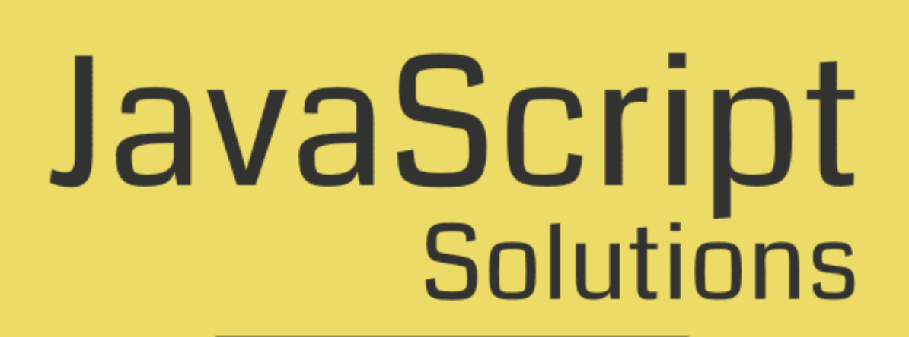

# JavaScript For Everyone Exercises with solutions.

## Demo

[solutions here](https://mostafain.github.io/JavaScript-For-Everyone-ExercisesWithSolutions/ExercisesIndex.html)

# Table of Contents

#### Exercises with solutions: 

1. variables
2. comments
3. data types
4. string
5. booleans
6. arithmetic operators
7. comparison operators
8. logical operators
9. conditions
10. loops 
11. arrays
12. functions
----------------------------
### available in Test branch
 
1. Test One Solutions
2. Test Two Solutions
3. Test Three Solutions
4. Test Four Solutions
----------------------------
1. fundamental

##### this is ongoing ...
